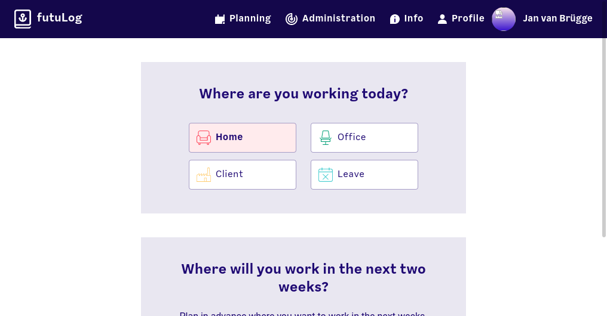
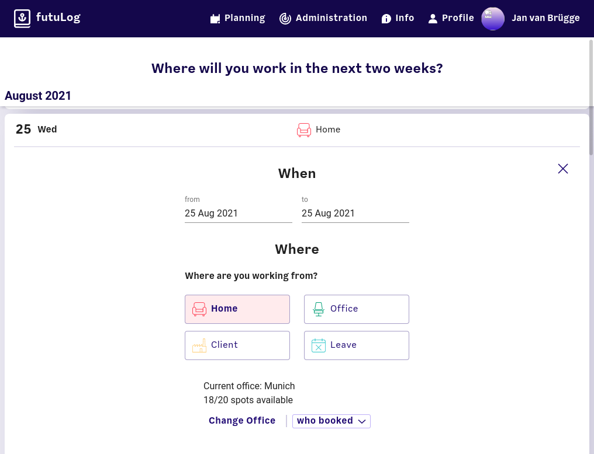
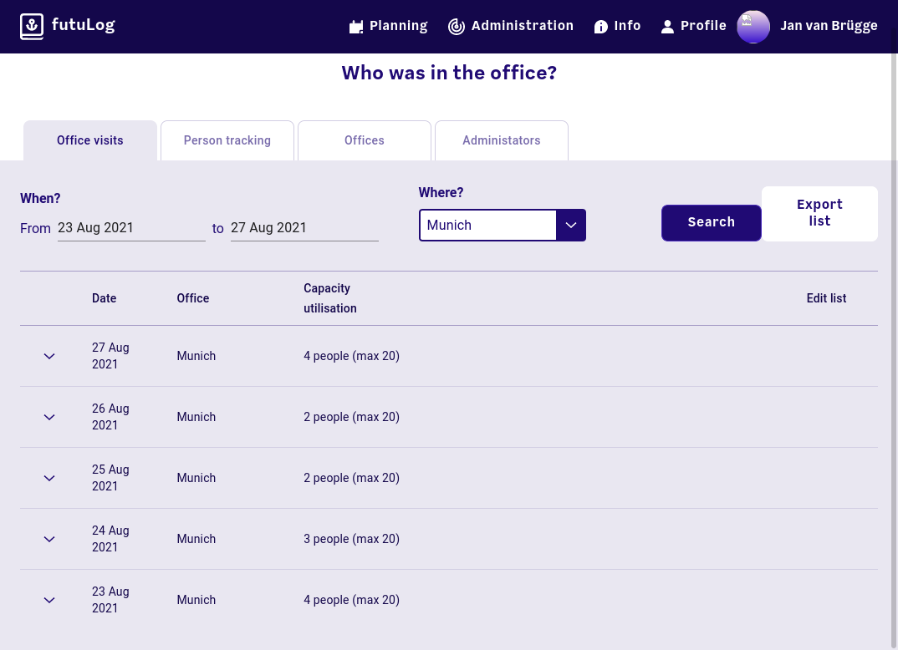

# FutuLog

This is a tool that was born out of two needs at Futurice:

1. To enable proper social distancing, the available spots in the office have to be reduced and it should be easily visible if there is still space left for you

2. In case of a positive COVID-19 case, it should be possible to query who was in the office with that person over the last two weeks in order to contact them and get tested too

The result is FutuLog! A normal user can set a default office that they work from and book slots in the office, either for the current day or for the future. Other users can see who has booked for a given day.

Administrators (e.g. Human Care or Office Management staff) can set the number of allowed people per office and query/export the list of people that were in contact with a given user.

## Screenshots

Main view:



Planning view:



Admin view:



## Deployment

FutuLog can use any OpenID Connect compliant identity provider. It is tested with [Okta](https://www.okta.com/) and [Keycloak](https://www.keycloak.org/). The [Dockerfile](./Dockerfile) builds a minimal debian container that only contains the backend server and the static frontend. It needs [Buildkit](https://docs.docker.com/develop/develop-images/build_enhancements/) in order to work. Use for example this command to build the container:

```bash
DOCKER_BUILDKIT=1 docker build -t "futurice/futulog:$(git rev-parse --short HEAD)"
```

Note that a clean build of the container will take roughly 30 minutes. It might also be necessary to allow docker to use 4GB of memory.

The container expects the following environment variables (see the [`docker-compose.yaml` file](./docker-compose.yaml)):
- `DB_URL`: The URL including username of password of the PostgresQL database
- `INITIAL_ADMIN`: The email address of a person that should be administrator. Other administrators can be added afterwards by this person
- `PUBLIC_URL`: The URL under which futulog is publicly accessible
- `OPENID_CLIENT_ID`: The client id of the OpenID Connect application that is used to authenticate users
- `OPENID_SECRET_TEXT`: The pre-shared secret to authorize futuLog to talk to the identity provider
- `OPENID_CONFIG_URI`: Where to find the discovery document for OpenID Connect. Usually this is `<identity provider url>/.well-known/openid-configuration`

## Local testing

To try out the whole application locally, the [`docker-compose.yaml` file](./docker-compose.yaml) launches futuLog together with Keycloak as identity provider and defines three users: `testuser1` (administrator), `testuser2` and `testuser3` (passwords are the same as the usernames). To build and run the container use this command (to run the containers in the background add `-d` at the end):

```bash
DOCKER_BUILDKIT=1 docker-compose build && docker-compose up
```
After everything is initialized, futuLog will be available at `http://localhost:8000`.

Again, a clean build will take roughly 30 minutes and docker might need up to 4GB of memory.

## Development

### Backend

The backend is written in Haskell, using the [`servant`](https://github.com/haskell-servant/servant) and the [`postgresql-simple`](https://hackage.haskell.org/package/postgresql-simple) libraries. To compile the backend outside of the docker-container, you need to have [`stack`](https://docs.haskellstack.org/en/stable/README/) installed on your machine. Then run:

```bash
cd backend
stack build
```
The first build will pull and compile all the dependencies, so it will take about 30 minutes to finish. After that all the dependencies are cached and only the changed source code files will be recompiled.

As the server also needs the identity provider and several environment variables, it is the easiest to use docker-compose to run it:
```bash
DOCKER_BUILDKIT=1 docker-compose build && docker-compose up
```

### Frontend

The frontend is written in TypeScript with React. To set everything up run:

```bash
cd frontend && npm install && npm run build
```

For development the dev-server can be used. First uncomment the line in the [`docker-compose.yaml`](./docker-compose.yaml) that specifies the `PUBLIC_URL` as `http://localhost:3000` and comment the original line. Then recreate the containers and run the dev server:

```bash
docker-compose up -d && npm run dev:frontend
```

## Deployment inside Futurice

To deploy this within Futurice, use the [`deploy.sh`](./deploy.sh) script. First configure a AWS profile as described [here](https://welcome.play.futurice.com/). Then set the environment variable `AWS_PROFILE` to that profile name. The script takes the following arguments:

```
$ export AWS_PROFILE=<name>
$ ./deploy.sh [staging|production|cd] [--dry-run]
```

`cd` is intended to use for continous delivery to staging only. `--dry-run` will only build the docker container, but neither push it to the registry nor deploy it. It will print the kubernetes yaml it would apply to stdout.
