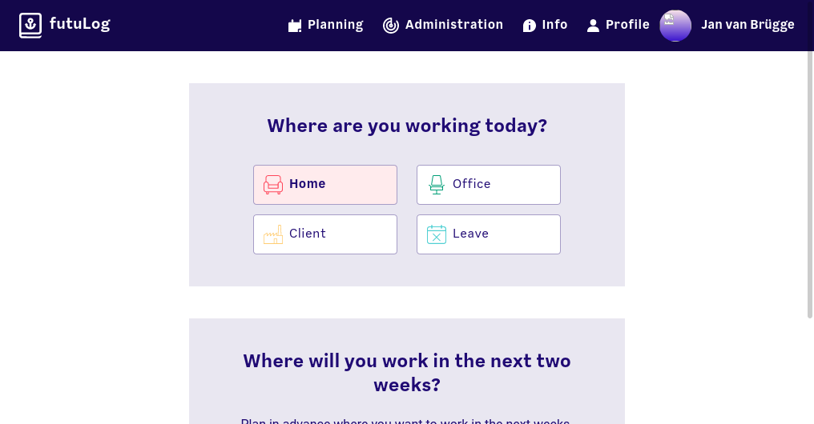

# Open Sourcing futuLog

Today, we are excited to announce that [futuLog](https://github.com/futurice/futuLog) is now Open Source, licensed under the MIT license. FutuLog was born out of the needs of Human Care and Office Management with regard to the COVID-19 pandemic. In particular, Futurice needed a tool that:

1. Would allow HC to limit the number of people that can go to the office depending on the current state of the pandemic

2. Would allow - in case of a positive test result - to find all the people that were in the office at the same time

3. Would be easy to use, so everyone would actually bother to use it.

Now, after a year of using futuLog internally, we have decoupled it completely from the Futurice-internal infrastructure, so it can be of use for other people that have a similar need.

# How does it look?

After logging in for the first time, you will be greeted with a welcome screen that lets you choose the office you normally work from. After that you see the main page where you can register for the current day:

In case you want to reserve a spot in the office for a day in the future, or want to see who has already booked a spot, you can use the planning page. This page also lets you choose to book a spot in a different office than your default office:

The whole page is also responsive and works well on mobile, so you can book a last minute spot if you are already on the way. For the offices itself, it is possible to generate a QR code that automatically checks you into the office when scanned, so a poster on the office door can remind you to check in:

# Administration

The whole tool can be managed by HC and office management. In the administration page, it is possible to add/remove offices, change the number of people allowed at the same time and add/remove other administrators. It also features two different modes of contact tracing: The first allows to check who was in the office in a given timespan. The second is for tracing the contacts of a single person. This is what would be used in case of a positive COVID-19 test. The administrator can select the person and a timeframe (for example 14 days) and then see what people were **with** that person in the office in the given timeframe. The results of both pages can be exported as a CSV file, so the data can be used for other purposes or tools (e.g. Excel):

# Want to learn more?

In case you think this could be useful to you and/or your company feel free to check out the code on [GitHub](https://github.com/futurice/futuLog). The README contains instructions on how to run futuLog yourself, it uses standard docker containers so it can be deployed almost everywhere. For more specific questions or if you want Futurice to help with the setup, feel free to open an issue on GitHub or contact us [via email](mailto://futulog-group@futurice.com).

We will also publish another article soon that goes more into the design and design research for futuLog as well as an article that explains the tech side in depth.
